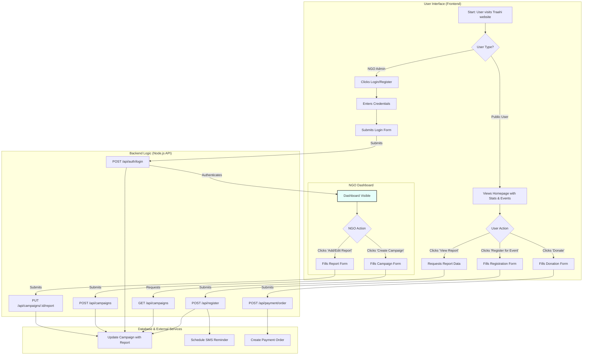

# 🚀 Traahi – NGO & Volunteer Connection Platform

<div align="center">
  
</div>

<p align="center">
A full-stack web platform built with <b>Node.js</b> and <b>PostgreSQL</b>, connecting NGOs with volunteers and donors to manage campaigns, secure donations, and drive community engagement.
</p>

<p align="center">


</p>

---

## 📌 About the Project

**Traahi** is a dynamic web application designed to bridge the gap between NGOs and the communities they serve. It offers a two-sided platform:

### 👥 For the Public

* Discover and filter volunteering events
* Register instantly for upcoming events
* Donate securely via Razorpay
* View detailed impact reports & galleries
* Light/Dark theme support

### 🏢 For NGOs

* Secure login & authentication (JWT)
* Private dashboard
* Create/Read/Update/Delete campaigns
* Upload cover images & gallery photos
* Post transparent impact reports
* Track volunteer registrations
* Manage donations

### ⚙️ Backend Automations

* Daily SMS reminders via Twilio (node-cron)
* Real-time volunteer count updates
* Secure & optimized REST API

---

## 🧩 Core Features

### 🌍 Public User Features

* 🔍 Event Discovery
* 🎯 Dynamic Filtering
* 📊 Live Stats on Homepage
* 📝 Volunteer Registration
* 🖼️ Report & Gallery Viewer
* 💳 Secure Razorpay Donations
* 🌓 Dark/Light Mode

---

### 🏢 NGO Admin Features

* 🔐 JWT Authentication
* 📊 NGO Dashboard
* 📁 Full Campaign Management
* 🖼️ Image Uploads (Multer)
* 📝 Impact Reporting

---

## 🛠️ Tech Stack

| Category      | Technology                    |
| ------------- | ----------------------------- |
| Frontend      | HTML, CSS, Vanilla JavaScript |
| Styling       | Tailwind CSS                  |
| Backend       | Node.js, Express.js           |
| Database      | PostgreSQL                    |
| Auth          | JWT, bcrypt.js                |
| Payments      | Razorpay API                  |
| Notifications | Twilio API                    |
| Scheduling    | node-cron                     |
| File Uploads  | Multer                        |

---

## 🔄 Application Flowchart



---

## 🚀 Future Enhancements

* Volunteer user accounts
* Recurring donations
* NGO analytics dashboard
* Email notifications
* Map-based event discovery
* Mobile app (React Native / Flutter)

---

## 📦 Installation Guide

### 1️⃣ Clone the Repository

```sh
git clone https://github.com/your-username/Traahi.git
cd Traahi
```

### 2️⃣ Install Backend Dependencies

```sh
cd traahi-backend
npm install
```

### 3️⃣ Create `.env` File

```
PORT=9000
DATABASE_URL=your_postgres_url
JWT_SECRET=your_secret_key
RAZORPAY_KEY_ID=xxx
RAZORPAY_KEY_SECRET=xxx
TWILIO_SID=xxx
TWILIO_AUTH=xxx
```

### 4️⃣ Start the Backend Server

```sh
node server.js
```

### 5️⃣ Run Frontend

Open `main/index.html` in your browser.

---

## 🤝 Contributing

1. Fork the repository
2. Create a new branch
3. Commit your changes
4. Submit a pull request

---

## 📜 License

This project is licensed under the **MIT License**.

---

## 📬 Contact

**Ashtsiddhi Kadam**
GitHub: [https://github.com/ashtsiddhi30](https://github.com/ashtsiddhi30)

